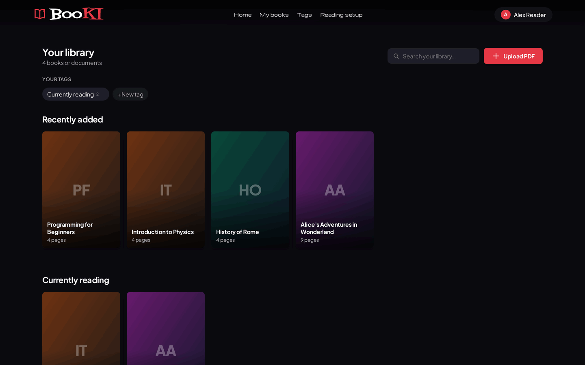
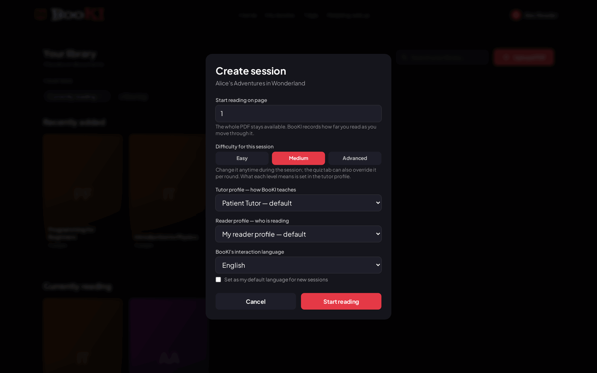
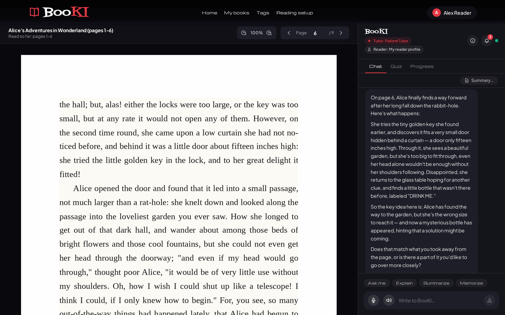
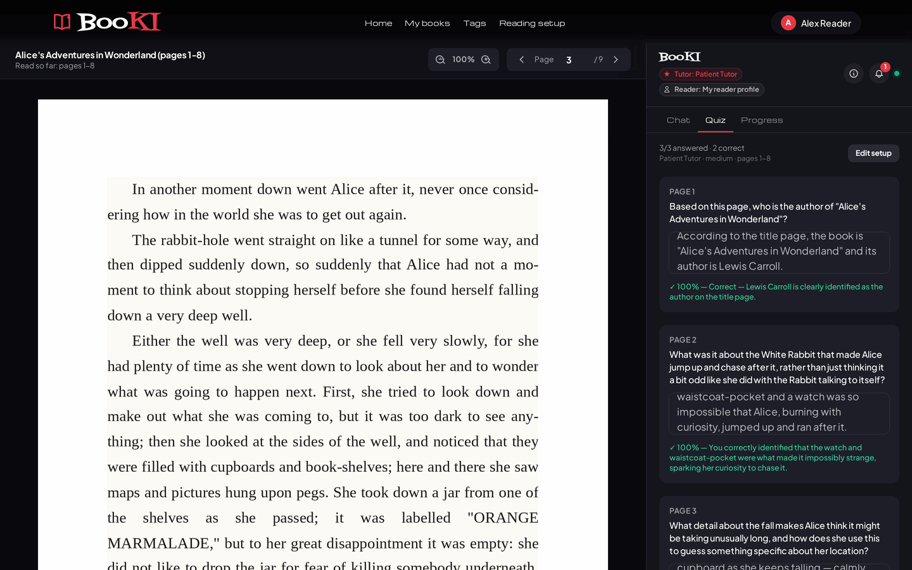
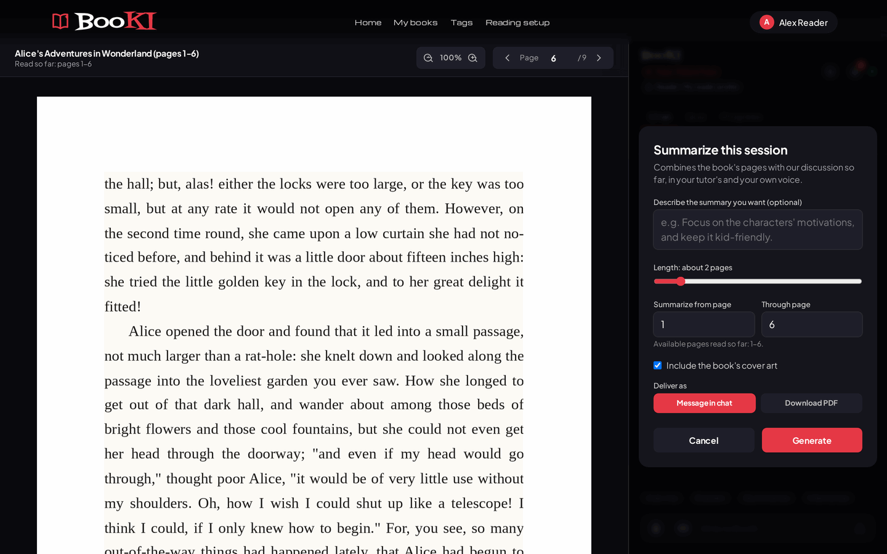
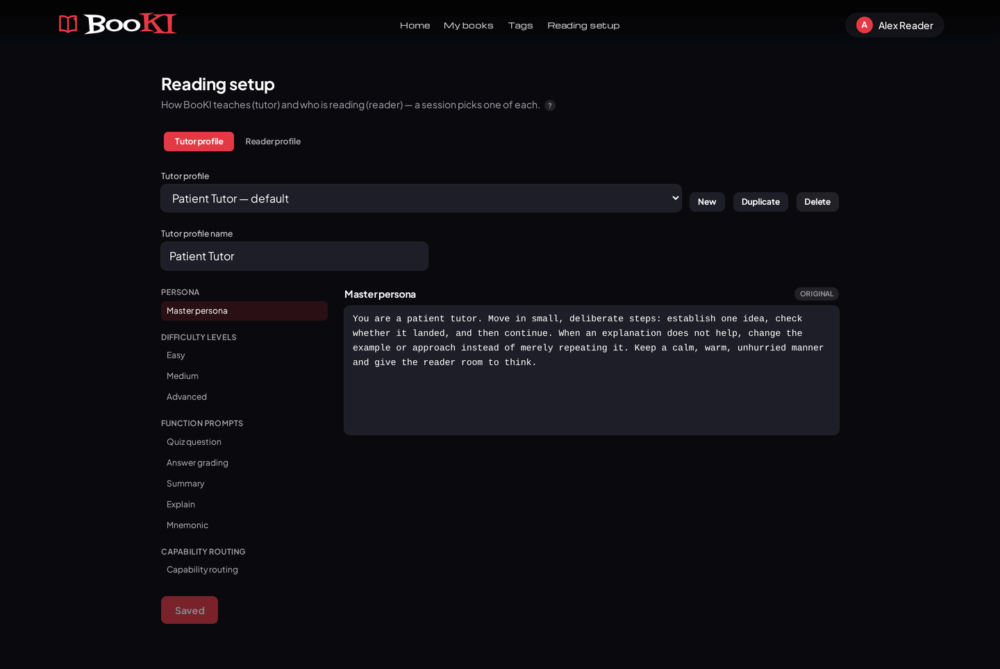
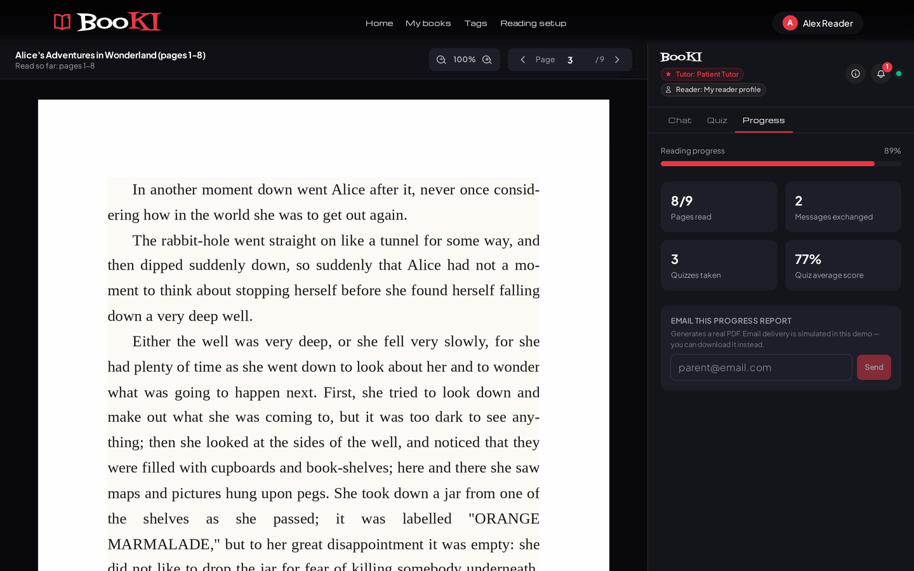
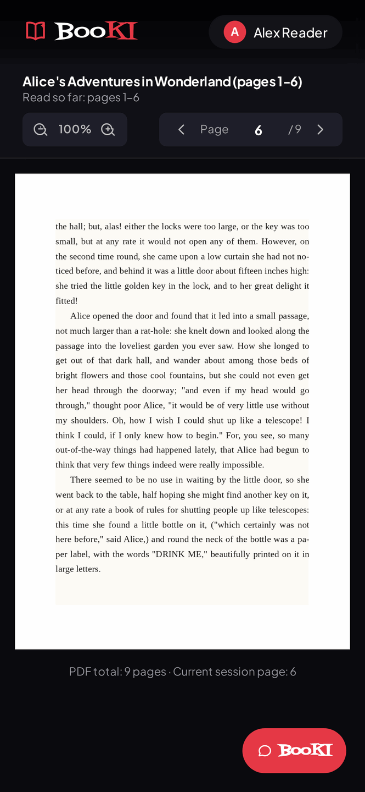

<h1 align="center">BooKI</h1>

<p align="center"><strong>Read your PDFs with someone to talk to.</strong></p>

<p align="center">
Upload a book, start reading anywhere, and ask questions by text or voice —
BooKI knows the page you're on and can explain a passage, quiz you, or
summarize what you've read, without ever leaving the page.
</p>

<p align="center">
  <a href="https://booki-507302.web.app"><strong>booki-507302.web.app</strong></a>
  &nbsp;·&nbsp;
  <a href="docs/booki-guide.pdf"><strong>Visual guide (PDF) →</strong></a>
</p>


---

## What is BooKI?

Reading a dense chapter alone can be slow going — you hit a paragraph you don't
follow, or you finish a section and aren't sure what stuck.

BooKI puts a patient reading companion next to the page. You open a PDF — a
textbook, a paper, a novel, your own notes — pick where to start, and read at
your own pace. Whenever you want, you type or speak a question and BooKI answers
using the pages around where you are. It can also quiz you on what you've
already read, summarize a range of pages, or explain a tricky passage — all in
the same conversation.

Nothing about the reading is blocked or gated: BooKI travels along with you, it
doesn't turn the book into homework.

## What you can do

### Build a library from your PDFs
Drop in any PDF and it joins your library, grouped into "Recently added",
your own tags, and "Long reads". Search by title to jump back in.



### Start reading anywhere in the book — a *session*
A session is one open-ended reading journey. Choose the page to start on, a
difficulty, the language BooKI replies in, and which tutor/reader profile to
use. The whole PDF stays available; BooKI just records how far you've read.



### Ask by text or voice — BooKI knows where you are
The reader is the PDF on the left and the conversation on the right. Ask about
"this page" and BooKI answers from the pages around you; name a page range and
it uses that instead. Speak your question with the mic and get a spoken reply
back, or keep it text-only.



### Quiz yourself on what you've read
BooKI keeps an activity page range next to the tabs — it starts as everything
you've read and follows along as you go, and you can narrow it to a single
chapter in a click. Pick how many questions you want (the count is independent
of how many pages the range covers) and BooKI spreads them across it. Answer in
your own words and each answer is marked with a score and specific feedback —
not just right/wrong. The same range bounds summaries and the chat quick-actions.



### Summaries and plain-language explanations, in the conversation
Ask for a summary of a range of pages, or tap "Explain" on a passage you didn't
follow. The result lands in the chat (or as a downloadable PDF) — you never
leave the reader.



### Tune how it teaches, and who's reading
A **tutor profile** is the full set of prompts a session runs on — its persona,
what each difficulty level means, and how it handles quizzes, summaries and
explanations. A **reader profile** describes who's reading (their level, their
goal, the subject). Keep a different one per subject you study.



### Follow your progress
Each session tracks how far you've read, how many questions you've asked, and
your quiz scores — and can email or download a progress report.



### One app, everywhere
BooKI is a single responsive web / PWA app — install it on Android, Windows or
Linux, or just use it in the browser.

<p align="center"></p>

## In four steps

1. **Upload a PDF** from the home screen.
2. **Create a session** — pick a starting page, difficulty, tutor and reader profile.
3. **Read and ask** — move through the PDF and talk to BooKI by text or voice.
4. **Check yourself** — run a quiz or ask for a summary on the pages you've read.

## Try it

- **Hosted:** [booki-507302.web.app](https://booki-507302.web.app) — sign up and upload a PDF.
- **New here?** Every new account starts with the [visual guide](docs/booki-guide.pdf) already
  in its library — open it and ask BooKI how anything works. The landing page's
  *Learn more* button opens the same PDF.
- **Run it yourself:** see *For developers* below.

---

<details>
<summary><strong>For developers</strong></summary>

<br>

A cloud-based conversational reading assistant: open-ended PDF reading sessions
with a context-aware AI you talk to by text or voice, a unified conversation
engine (text + voice + capabilities), per-session AI provider, quiz, progress
and reports, and cloud STT/TTS. One responsive web / PWA app for Android,
Windows and Linux.

### Monorepo structure

```
booki/
├── backend/          # Spring Boot 4.1 + Java 21 + Gradle
├── frontend/         # React + TypeScript + Vite + PWA
├── docs/             # Vision, architecture, and agent memory
├── docker-compose.yml
├── .env.example
└── README.md
```

### Requirements

- Java 21
- Gradle (wrapper included at `backend/gradlew`)
- Node.js 20+ and npm (for the frontend)
- Docker and Docker Compose **optional** (for PostgreSQL; you can also use H2)
- An AI provider API key for the assistant (Anthropic by default; OpenAI / Kimi / local Ollama also supported)
- Optional: an OpenAI key for cloud voice (STT/TTS) — without it, voice falls back to the browser recognizer (Chromium only)

### Quick start (H2, no Docker)

```bash
# backend — file-based H2 at ~/booki-local-db, listens on :8080
cd backend && ./gradlew bootRunLocal

# frontend — listens on :5173
cd frontend && npm install && npm run dev
```

Open `http://localhost:5173`, sign up, upload a PDF, click a book to create a
session, then read and chat.

The full picture — port map, the `dev` profile with PostgreSQL + Docker, HTTPS
for mobile testing, Ollama, object storage — is in
[docs/local-dev.md](docs/local-dev.md).

### AI configuration

Set values in `.env` at the repo root (read automatically by `bootRun` /
`bootRunLocal`). All four providers — `claude`, `openai`, `kimi`, `ollama` — are
always available; a session picks one at creation, falling back to
`AI_PROVIDER`.

```bash
AI_PROVIDER=claude
ANTHROPIC_API_KEY=sk-ant-...
# other providers: OPENAI_API_KEY=sk-proj-...  /  KIMI_API_KEY=...  /  (ollama needs no key)
```

The same `OPENAI_API_KEY` also powers cloud voice (backend STT/TTS). Full
variable list and model/voice options: [docs/backend.md](docs/backend.md) and
[docs/ai-voice.md](docs/ai-voice.md).

### The visual guide

`docs/booki-guide.pdf` is generated from `docs/booki-guide.html` +
`docs/images/`. Rebuild it (and the copies the app ships — `frontend/public/`
for the *Learn more* link, `backend/src/main/resources/welcome/` for the
document every new account gets) with:

```bash
cd frontend && npm install      # once — for the Playwright/Chromium dep
node scripts/build-guide.mjs     # from the repo root
```

Turn the auto-added welcome document off with `WELCOME_DOCUMENT_ENABLED=false`.

### Documentation

- [docs/vision.md](docs/vision.md) — product vision and principles.
- [docs/architecture.md](docs/architecture.md) — stack and structure.
- [docs/backend.md](docs/backend.md) — backend details and AI configuration.
- [docs/frontend.md](docs/frontend.md) — frontend details.
- [docs/prompts.md](docs/prompts.md) — prompts, AI Profiles (persona, difficulty, per-function) and reader profiles.
- [docs/ai-voice.md](docs/ai-voice.md) — AI and voice strategy.
- [docs/decisions.md](docs/decisions.md) — architecture decisions.
- [docs/agent-memory.md](docs/agent-memory.md) — compact summary.
- [docs/local-dev.md](docs/local-dev.md) — how to run/stop each server locally.
- [docs/deployment.md](docs/deployment.md) — deployment plan (DB migration, storage, hosting, CI/CD).

### Status

Core product in place: authentication, PDF library and per-page extraction,
open-ended reading sessions, AI Profiles + reader profiles (the per-session
prompt set — `docs/prompts.md`), the unified conversation engine (text + voice +
capabilities), per-session AI provider, quiz, progress, reports, and cloud
STT/TTS. A post-review hardening pass (ADR-016) added `/actuator` auth, security
headers/CSP, request validation, provider timeouts, transactions, an ESLint gate
and a deploy-time test gate. Voice streaming (incremental STT/TTS) is architected
but not wired — see [docs/ai-voice.md](docs/ai-voice.md) "Streaming".

**Next:** broader backend test coverage (controller / repository / security),
then the smaller ADR-016 leftovers.

</details>
